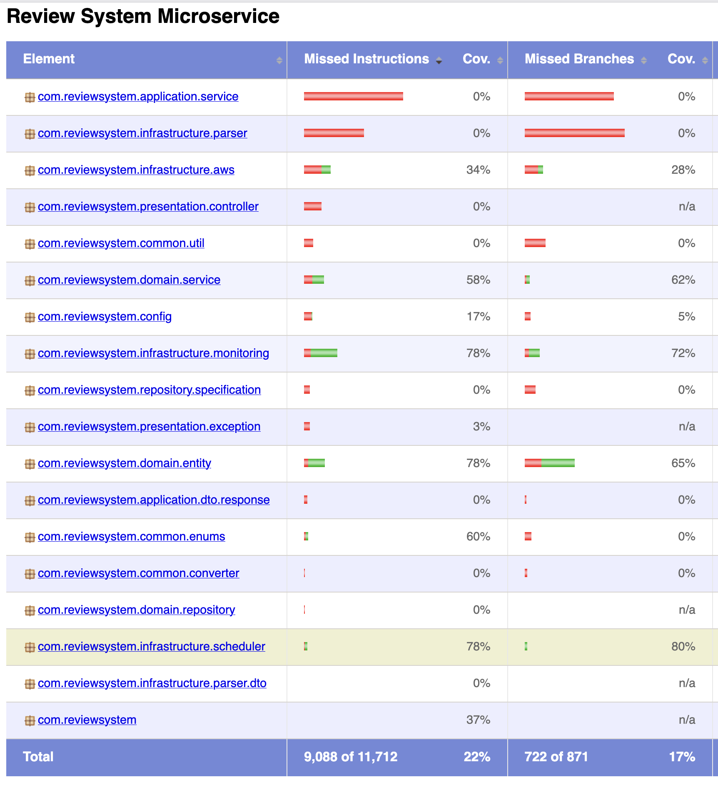

# Review System Microservice

A robust, scalable microservice for processing hotel review data from third-party providers (Agoda, Booking.com, Expedia). The system automatically retrieves JSONL files from AWS S3, processes and validates the data, and stores it in a PostgreSQL database.

## 🏗️ Architecture

The application follows Clean Architecture principles with clear separation of concerns:

- **Presentation Layer**: REST controllers, exception handling
- **Application Layer**: Use cases, DTOs, orchestration services
- **Domain Layer**: Business entities, domain services, repository interfaces
- **Infrastructure Layer**: AWS S3 integration, data parsing, scheduling

For detailed architecture refer to [Project Architecture](./docs/00_project_architecture.md) doc.

## 🚀 Features

- ✅ **Automated Processing**: Scheduled retrieval and processing of review files
- ✅ **Idempotent Operations**: Prevents duplicate processing of files
- ✅ **Robust Error Handling**: Comprehensive error handling with retry mechanisms
- ✅ **RESTful API**: Query reviews with filtering, pagination, and sorting
- ✅ **Monitoring & Health Checks**: Built-in health indicators and metrics
- ✅ **Docker Support**: Containerized deployment with docker-compose
- ✅ **Multiple Deployment Options**: Web service, scheduled jobs, or command-line tool
- ✅ **Database Migration**: Flyway plugin for database migrations
- ✅ **Pre-commit hooks**: For code quality and reliability.


## 📋 Prerequisites

- **Java 17** or higher
- **Maven 3.8+**
- **Docker & Docker Compose**
- **AWS CLI** (for production deployment)

## 🛠️ Quick Start
### 0. Pre-commit Hooks (Automated Quality Gates)

**One time Setup**

This project uses Maven to manage and install Git pre-commit hooks for code quality and reliability. No extra tools or manual copying required—just Maven!

### How it Works
- The `hooks/pre-commit` script is versioned in the repo.
- On `mvn install`, the script is automatically installed to `.git/hooks/pre-commit` and made executable.
- On every commit, the following checks run:
    - Code formatting (Spotless)
    - Linting (Checkstyle)
    - Static analysis (PMD)
    - Unit tests
    - Code coverage report (JaCoCo)
- If any check fails, the commit is blocked with a helpful message.

### 1. Clone the Repository
```bash
git clone <repo-url>
cd review-system-microservice
```

### 2. Environment Setup
```bash
# Copy environment template
cp .env.local .env

# Edit configuration (see Configuration section)
vi .env
```

### 3. Start with Docker Compose (Recommended)
**One time setup**
```bash
# Make the setup script executable and run it
chmod +x docker/setup.sh && ./docker/setup.sh
```

#### To Run all services
```
# Start all services (app, database, LocalStack S3)
docker-compose up --build -d

# View logs
docker-compose logs -f review-system-app

# Stop services
docker-compose down
```

### 4. Manual Setup (Development)
```bash
# Start PostgreSQL and LocalStack
docker-compose up -d postgres localstack

# Run application
./mvnw spring-boot:run -Dspring-boot.run.profiles=local

# Or build and run JAR
./mvnw clean package
java -jar target/review-system-microservice-1.0.0.jar
```


After starting, wait for 10seconds to job to process for first time. Then hit the api to see data
http://127.0.0.1:8080/api/v1/reviews

## 🔧 Configuration

### Default Users
```
User:
	name: user
	password: password
	role: USER
Admin:
	name: admin
	password: adminpass
	role: ADMIN
```

### Environment Variables
Verify all details in  `src/main/resources/application-local.yml`  are correct.

### Application Profiles

#### Development Profile (`application-local.yml`)
- Uses LocalStack for S3 simulation
- H2 in-memory database option
- Detailed logging enabled
- Hot reload enabled

#### ToDo: Production Profile (`application-prod.yml`)
- Real AWS S3 integration
- Connection pooling optimizations
- Security hardening
- Structured logging


## 🏃‍♂️ Running the Application

### Option 1: Web Service (Default)
```bash
# Start as web service with REST API
docker-compose up -d
```

### Option 2: Scheduled Processing Only
```bash
# Run as scheduled job (no web interface)
docker run -e SPRING_PROFILES_ACTIVE=scheduler-only review-system-microservice:latest
```

## 🧪 Work in Progress: Testing

Coverage as of now



### Running Tests

```bash
# Run all tests
./mvnw test

# Run specific test categories
./mvnw test -Dtest="**/*UnitTest"
./mvnw test -Dtest="**/*IntegrationTest"

# Run tests with coverage
./mvnw test jacoco:report
open target/site/jacoco/index.html
```

### Run tests as pre-hook

Uncomment below section in `hooks/pre-commit`
```
# # Run tests on affected modules
# echo "Running tests..."
# if ! mvn test -q; then
#   echo "❌ Tests failed. Please fix before committing."
#   exit 1
# fi

# # Update test case reports
# echo "Running tests..."
# if ! mvn jacoco:report -q; then
#   echo "❌ JaCoCo coverage report generation failed."
#   exit 1
# fi
```

## 📈 Monitoring & Logging

### Health Checks

The application provides comprehensive health checks:

- **Database Connectivity**: PostgreSQL connection status
- **S3 Connectivity**: AWS S3 bucket accessibility
- **Processing Status**: Current processing queue status
- **Disk Space**: Available disk space for file processing

### Custom Metrics

- `reviews.processed.count`: Total reviews processed
- `files.processing.time`: Average file processing time
- `errors.validation.count`: Number of validation errors
- `reviews.by.provider`: Reviews count by provider


## 🚨 Error Handling

### Common Error Scenarios

1. **AWS S3 Errors**
    - Connection timeouts → Automatic retry with exponential backoff
    - Access denied → Log error and skip file
    - File not found → Mark as processed to avoid reprocessing

2. **Data Validation Errors**
    - Malformed JSON → Log error and continue with next record
    - Missing required fields → Skip record and log validation error
    - Invalid date formats → Apply default date transformation

3. **Database Errors**
    - Connection failures → Retry with circuit breaker
    - Constraint violations → Log detailed error and skip record
    - Transaction rollbacks → Rollback batch and retry smaller batches

### Error Response Format

```json
{
  "timestamp": "2025-07-29T10:30:00Z",
  "status": 400,
  "error": "Bad Request",
  "message": "Invalid request parameters",
  "path": "/api/v1/reviews",
  "correlationId": "abc-123-def-456",
  "details": [
    {
      "field": "ratingMin",
      "message": "Rating must be between 0 and 10"
    }
  ]
}
```

## 🔐 Security

### API Security
- **Authentication**: JWT tokens for admin endpoints
- **Rate Limiting**: Prevent API abuse (100 requests/minute per IP)
- **Input Validation**: Comprehensive request validation
- **CORS Configuration**: Configurable cross-origin requests

### AWS Security
- **IAM Roles**: Least privilege access to S3 buckets
- **Encryption**: S3 server-side encryption enabled
- **VPC Configuration**: Network isolation in production

### Database Security
- **Connection Encryption**: SSL/TLS for all database connections
- **Secrets Management**: External secret management support
- **SQL Injection Prevention**: Parameterized queries via JPA


## ToDo
- [ ] Complete prometheus setup for advanced monitoring
- [ ] Improve Test Coverage and fix failing tests
- [ ] use `.env` file for docker and application properties or yml files
- [ ] Performance & Scalability
- [ ] Improve Error handling
- [ ] Cachemanager is currently disabled, 
- [ ] `ToDo` marked in code, should be worked on