# Review System Microservice - Architecture & Design Document

## Table of Contents
1. [System Overview](#system-overview)
2. [Architecture Diagram](#architecture-diagram)
3. [Component Design](#component-design)
4. [Data Flow](#data-flow)
5. [Database Schema](#database-schema)
6. [API Design](#api-design)
7. [Configuration Management](#configuration-management)

## System Overview

The Review System Microservice is a Spring Boot-based application that processes hotel review data from third-party providers (Agoda, Booking.com, Expedia) stored in AWS S3, validates and transforms the data, and stores it in a PostgreSQL database.

### Key Features
- **Automated S3 Processing**: Scheduled retrieval and processing of JSONL files
- **Idempotent Processing**: Prevents duplicate processing of files
- **Robust Error Handling**: Comprehensive error handling with retry mechanisms
- **RESTful API**: Query and management endpoints
- **Monitoring & Health Checks**: Built-in health indicators and metrics
- **Scalable Architecture**: Clean architecture with clear separation of concerns

## Architecture Diagram



## Component Design

### 1. Presentation Layer
**Responsibility**: Handle HTTP requests, response formatting, and API documentation

#### Controllers
- **ReviewController**: CRUD operations for reviews, filtering, pagination
- **AdminController**: Administrative operations (trigger processing, system status)
- **HealthController**: Custom health checks and system monitoring

#### Exception Handling
- **GlobalExceptionHandler**: Centralized exception handling with proper HTTP status codes
- **Custom Exceptions**: Domain-specific exceptions with meaningful error messages

### 2. Application Layer
**Responsibility**: Use cases, business workflows, and data transformation

#### Services
- **ReviewProcessingService**: Orchestrates file processing workflow
- **ReviewQueryService**: Handles complex queries and filtering
- **ProcessingOrchestrationService**: Manages processing scheduling and coordination

#### DTOs & Mappers
- **Request/Response DTOs**: API contract definitions
- **Entity Mappers**: Convert between domain entities and DTOs

### 3. Domain Layer
**Responsibility**: Core business logic and domain entities

#### Entities
```java
// Core domain entities with business logic
@Entity
public class Review {
    ...
}

@Entity  
public class Provider {
    ...
}

@Entity
public class ProcessedFile {
    ...
}
```

#### Repositories
- Interface definitions following repository pattern
- Custom query methods for complex business operations

### 4. Infrastructure Layer
**Responsibility**: External integrations and technical implementations

#### AWS Integration
```java
@Service
public class S3Service {
    public List<S3ObjectSummary> listNewFiles(String bucket, String prefix);
    public InputStream downloadFile(String bucket, String key);
    public boolean fileExists(String bucket, String key);
}
```

#### Data Processing
```java
@Component  
public class JsonLParser {
    public Stream<ReviewData> parseFile(InputStream fileStream);
    public boolean validateJsonLine(String jsonLine);
}

@Component
public class ReviewDataValidator {
    public ValidationResult validate(ReviewData data);
    public List<ValidationError> getValidationErrors();
}
```

#### Scheduling
```java
@Component
public class ReviewProcessingScheduler {
    @Scheduled(cron = "${app.processing.schedule}")
    public void processNewFiles();
    
    @Scheduled(fixedDelay = 3600000) // 1 hour
    public void cleanupOldFiles();
}
```

## Data Flow

### 1. Scheduled Processing Flow
```
1. Scheduler triggers → S3Service.listNewFiles()
2. Filter unprocessed files → FileTrackingService.isProcessed()
3. Download file → S3Service.downloadFile()
4. Parse JSONL → JsonLParser.parseFile()
5. Validate data → ReviewDataValidator.validate()
6. Transform data → ReviewDataTransformer.transform()
7. Save to database → ReviewRepository.saveAll()
8. Mark as processed → ProcessedFileRepository.save()
```

### 2. API Query Flow
```
1. HTTP Request → ReviewController
2. Validate request → RequestValidator
3. Query database → ReviewQueryService
4. Apply filters → ReviewRepository.findWithFilters()
5. Map to DTOs → ReviewMapper.toDto()
6. Return response → ResponseEntity<PagedResponse>
```

## API Design

### Review Endpoints
```
GET /api/v1/reviews
  - Query parameters: page, size, sort, provider, hotelId, ratingMin, ratingMax, dateFrom, dateTo
  - Response: PagedResponse<ReviewResponse>

GET /api/v1/reviews/{id}  
  - Response: ReviewResponse

GET /api/v1/reviews/statistics
  - Query parameters: provider, dateFrom, dateTo
  - Response: ReviewStatisticsResponse
```

### Admin Endpoints
```
POST /api/v1/admin/processing/trigger
  - Request: ProcessingTriggerRequest
  - Response: ProcessingStatusResponse

GET /api/v1/admin/processing/status
  - Response: ProcessingStatusResponse

GET /api/v1/admin/files/processed
  - Query parameters: page, size, status
  - Response: PagedResponse<ProcessedFileResponse>
```

### Health & Monitoring
```
GET /actuator/health
  - Custom health indicators for S3, Database, Processing Queue

GET /actuator/metrics
  - Custom metrics: reviews.processed.count, files.processing.time, errors.count

GET /actuator/info
  - Application information and build details
```

## Configuration Management

### Application Properties Structure
```yaml
app:
  aws:
    s3:
      bucket: ${AWS_S3_BUCKET:review-data-bucket}
      region: ${AWS_REGION:us-east-1}
      prefix: ${AWS_S3_PREFIX:reviews/}
  processing:
    schedule: ${PROCESSING_SCHEDULE:0 0 2 * * ?}  # Daily at 2 AM
    batch-size: ${PROCESSING_BATCH_SIZE:1000}
    concurrent-files: ${CONCURRENT_FILES:3}
  database:
    pool:
      initial-size: ${DB_POOL_INITIAL:5}
      max-size: ${DB_POOL_MAX:20}
      max-wait: ${DB_POOL_MAX_WAIT:30000}
```

### Environment-Specific Profiles
- **application-local.yml**: Development configuration with LocalStack
- **application-test.yml**: Test configuration with TestContainers  
